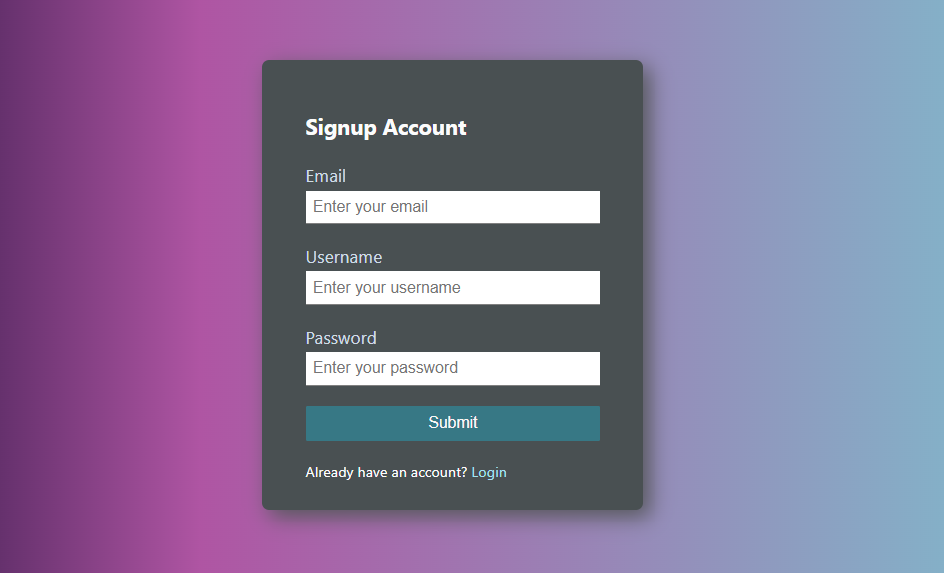
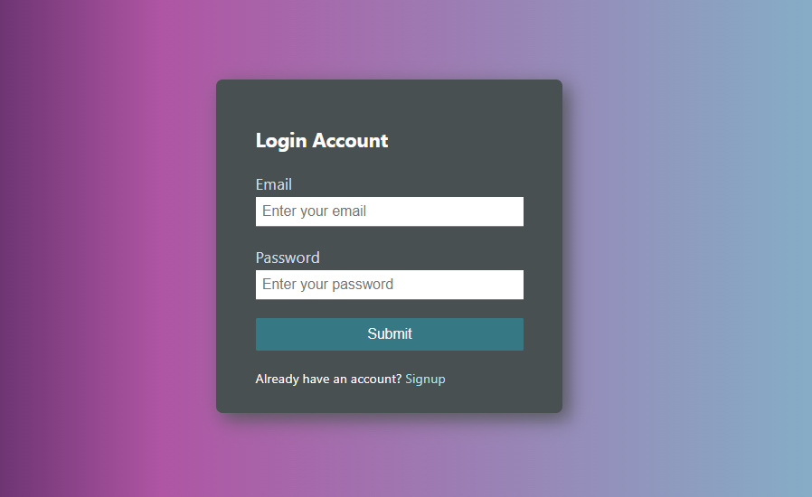

# jwt-authentication-system
This project demonstrates a secure user authentication system using JSON Web Tokens (JWT) with a React frontend and a Node.js/Express backend. Users can sign up, log in, and access protected routes, ensuring data security through password hashing. The project showcases modern web development technologies for a seamless and secure user experience.

